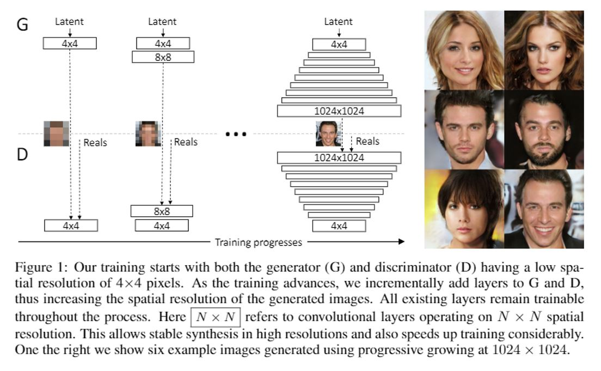
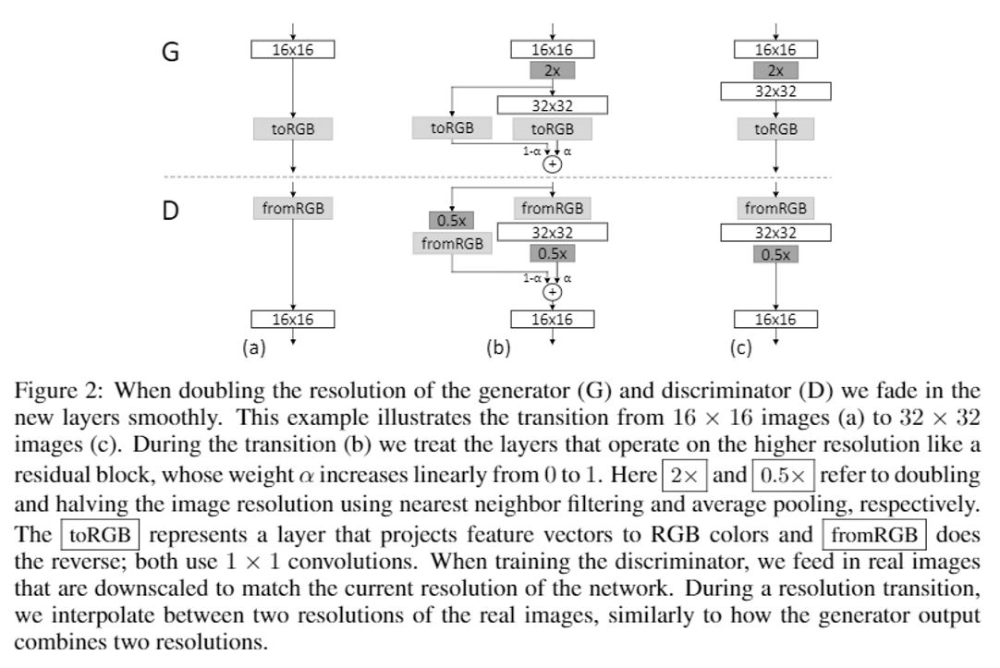
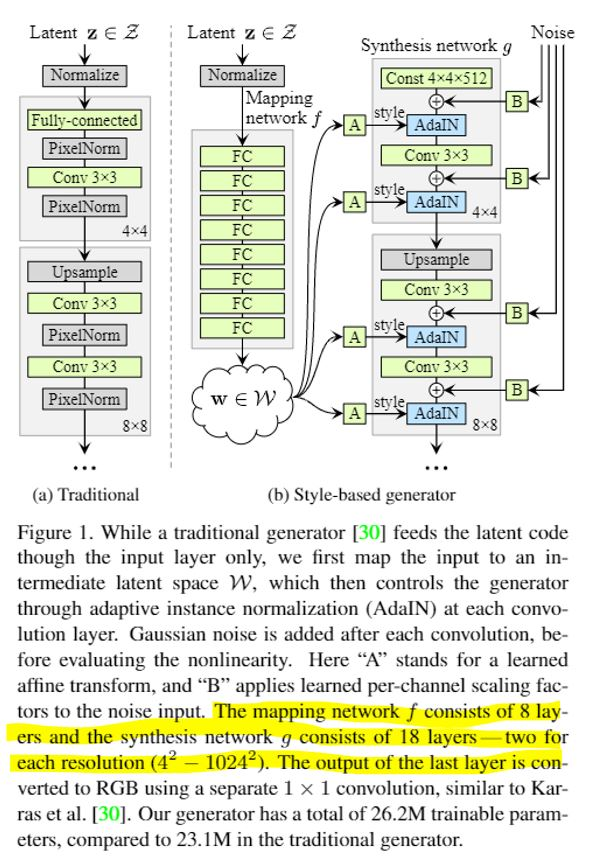

## Progressive GAN 
### Progressive growing of GAN
- Start with low-resolution images and then progressively increasing the resolution by adding layers to the network!

## Style GAN
### Style-based generator
Style GAN substitutes the input latent code with a learned constant and transform original input latent code into feature space and add the style information in to the generator progressively. The input latent code $z$ is in the latent space $Z$, and a non-linear mapping network (8-layer MLP)performs to map $Z \to W$ and produce a style vector $w \in W$. 

Learned affine transformation (denoted by A in Figure 1) then specialize $w$ to *styles* $y=(y_s,y_s)$ that control adaptive instance normalization (AdaIN) operations after each convolution layer of synthesis network $g$. The AdaIN operation is defined as

$$
AdaIN(x_i,y)=y_{s,i}\frac{x_i-\mu(x_i)}{\sigma(x_i)}+y_{b,i}
$$

This operation stands for scaling the feature map of $g$ to match the distribution of the *style code* y.

