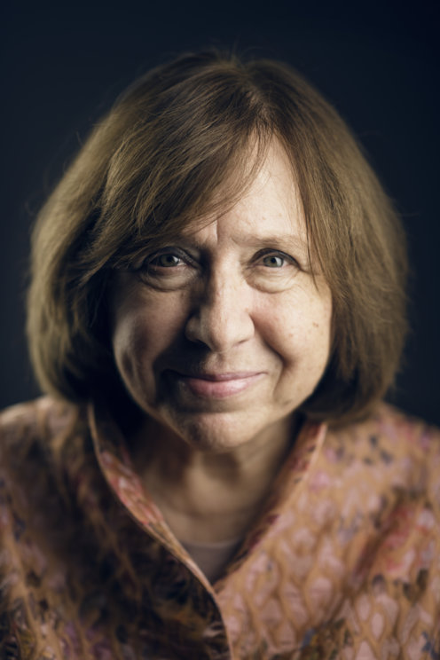

战后，西奥多阿多诺在震惊中写道：“奥斯维辛之后，写诗都变得粗俗。”我的老师Ales Adamovich——我今天带着感激提起他的名字——认为用散文叙述20世纪的噩梦是一种亵渎。不用发明任何东西。你必须如实写下来。需要一种“超文学”。见证者必须说话。我想起尼采的话——没有艺术家能完全达到真实。

令我感到困扰的是，真实不是存在于一颗心灵、一个头脑中，真实某种程度上被分裂了。有很多个真实，而且各不相同，分散在世界各地。陀思妥耶夫斯基认为，人类对自己的了解，远远多于文学中记录的。所以我在做的是什么？我收集日常生活中的感受、思考和话语。我收集我所处时代的生活。我对心灵史感兴趣——日常生活中的心灵，被历史宏图忽略或看不上的那些东西。我致力于缺失的历史。

经常有人告诉我，我所写的不是文学，是文献。今天文学是什么？谁能回答？我们的节奏空前地快。内容打破和改变了形式。一切东西都在溢出边缘：音乐、绘画，即便是文献中的语言也在逃离原本的边界。在真实和虚构之间没有界限，它们相互流动。见证者不是纯粹中立的。在讲故事时，人们会进行加工创造。他们与时间角力，如同雕刻家面对大理石。他们是演员，也是创作者。

我对小人物感兴趣。我想关注渺小却伟大的人物，因为痛苦能塑造人。在我的书中，他们讲述自己的小历史，大历史也从中展现出来。我们还没有时间来理解已经发生以及正在发生的事情，但是我们需要说出来。首先，我们需要清楚地表述出来。（但）我们害怕这样做，我们还没有准备好面对我们的过去。在陀思妥耶夫斯基的小说《群魔》中，沙托夫在和斯塔夫罗金的对话一开始就说：“在无限无穷的世界里，我们是最后一次相遇的两个生物……别用那种腔调，像人一样说话吧。至少，用人的声音说一次话。”

我和我的主角们差不多就是这样开始对话的。人们从他们自己的时代发声，当然，他们不可能处于真空。但是，人类的心灵是很难抵达的，这条路被电视、报纸以及这个世纪的迷信、偏见、谎言弄乱了。