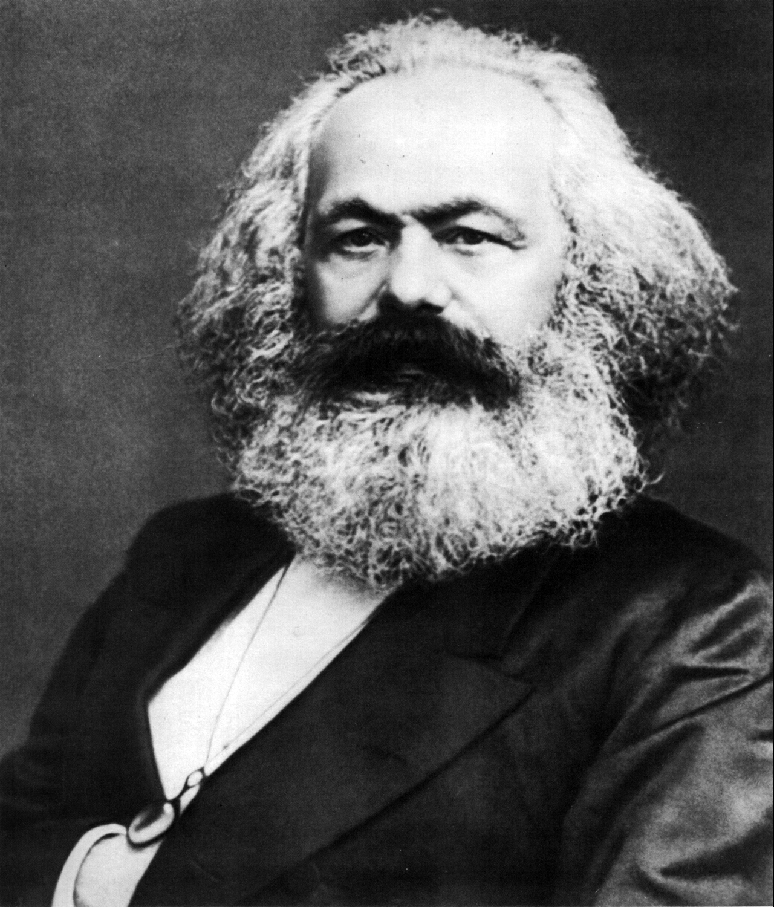

## 1
一个幽灵，共产主义的幽灵，在欧洲大陆徘徊。为了对这个幽灵进行神圣的围剿，旧欧洲的一切势力，教皇和沙皇、梅特涅和基佐、法国的激进派和德国的警察，都联合起来了。

有哪一个反对党不被它的当政的敌人骂为共产党呢？又有哪一个反对党不拿共产主义这个罪名去回敬更进步的反对党人和自己的反动敌人呢？

从这一事实中可以得出两个结论：
1. 共产主义已经被欧洲的一切势力公认为一种势力；
2. 现在是共产党人向全世界公开说明自己的观点、自己的目的、自己的意图并且拿党自己的宣言来反驳关于共产主义幽灵的神话的时候了。

## 2
资产阶级在它已经取得了统治的地方把一切封建的、宗法的和田园诗般的关系都破坏了。它无情地斩 断了把人们束缚于天然尊长的形形色色的封建羁绊，它使人和人之间除了赤裸裸的利害关系，除了冷酷无情的“现金交易”，就再也没有任何别的联系了。它把宗教 虔诚、骑士热忱、小市民伤感这些情感的神圣发作，淹没在利己主义打算的冰水之中。它把人的尊严变成了交换价值，用一种没有良心的贸易自由代替了无数特许的 和自力挣得的自由。总而言之，它用公开的、无耻的、直接的、露骨的剥削代替了由宗教幻想和政治幻想掩盖着的剥削。

资产阶级抹去了一切向来受人尊崇和令人敬畏的职业的神圣光环。它把医生、律师、教士、诗人和学者变成了它出钱招雇的雇佣劳动者。

资产阶级撕下了罩在家庭关系上的温情脉脉的面纱，把这种关系变成了纯粹的金钱关系。
