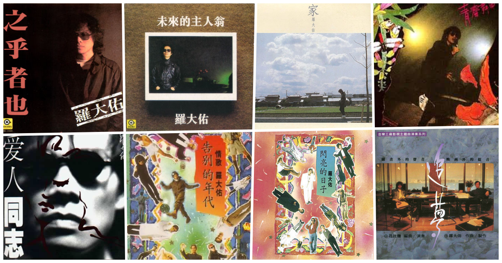

Lo Tayou (罗大佑), Chinese Musician born in Taiwan.

- 未来的主人翁(The owner of future)
<iframe width="1280" height="720" src="https://www.youtube.com/embed/eQW5-IHV4hM" frameborder="0" allow="accelerometer; autoplay; encrypted-media; gyroscope; picture-in-picture" allowfullscreen></iframe>

-  鹿港小镇(Lukang, the Samll Town)
<iframe width="1280" height="720" src="https://www.youtube.com/embed/Xgjny7YFMD4" frameborder="0" allow="accelerometer; autoplay; encrypted-media; gyroscope; picture-in-picture" allowfullscreen></iframe>