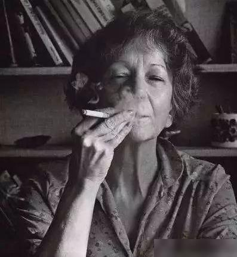

Maria Wisława Anna Szymborska (2 July 1923 – 1 February 2012) was a Polish poet, essayist, translator and recipient of the 1996 Nobel Prize in Literature. Szymborska was awarded the 1996 Nobel Prize in Literature "for poetry that with ironic precision allows the historical and biological context to come to light in fragments of human reality".

**View with a Grain of Sand**

*by Wislawa Szymborska*

We call it a grain of sand,
but it calls itself neither grain nor sand.
It does just fine without a name,
whether general, particular,
permanent, passing,
incorrect, or apt.

Our glance, our touch mean nothing to it.
It doesn't feel itself seen and touched.
And that it fell on the windowsill
is only our experience, not its.
For it, it is no different from falling on anything else
with no assurance that it has finished falling
or that it is falling still.

The window has a wonderful view of a lake,
but the view doesn't view itself.
It exists in this world
colorless, shapeless,
soundless, odorless, and painless.

The lake's floor exists floorlessly,
and its shore exists shorelessly.
Its water feels itself neither wet nor dry
and its waves to themselves are neither singular nor plural.
They splash deaf to their own noise
on pebbles neither large nor small.

And all this beneath a sky by nature skyless
in which the sun sets without setting at all
and hides without hiding behind an unminding cloud.
The wind ruffles it, its only reason being
that it blows.

A second passes.
A second second.
A third.
But they're three seconds only for us.

Time has passed like a courier with urgent news.
But that's just our simile.
The character is invented, his haste is make-believe,
his news inhuman.

**用一粒沙观看**
*辛波丝卡*

我们叫它一粒沙。 但它不叫自己粒或沙。
它就这样存在着，没有一个系统、特别、 短暂、永久、不确或切合的名字。
它不需要我们的顾盼，我们的触摸。
它不感到自己被觉察和触摸。
它掉落在窗沿这一事实 只是我们的、而非它的经验。
它掉落在任何事物上也是如此 并不证明了它已经掉落 或仍在掉落。
从窗口可以观看到很好的湖景 但是湖景本身是无法观看自己的 它存在于这个世界，
没有颜色和形状 没有声音，没有味道，也没有痛苦。

湖底对自己是无底的， 岸对自己也无岸。
它的水对自己也是不湿不干的。
它的波浪也不感单一或个别
这些波浪在既不小也不大的石头周围
对自己那听若无闻的轻声细语轻声细语。
而这一切都是在一个本身没有天空的天空下发生的，
太阳在那里一点也不沉落地沉落
一点也不隐藏地隐藏在一朵非自愿的云团背后。
风费力地拖着它没有任何理由 只不过是吹罢了。

一秒过去，另一秒，第三秒。
但是这只是我们的三秒。
时间像一个带着急件的信使飞驰着。
但着只是我们的比喻。
一个创造出来的人物自己越讲越急， 而消息是无人性的。